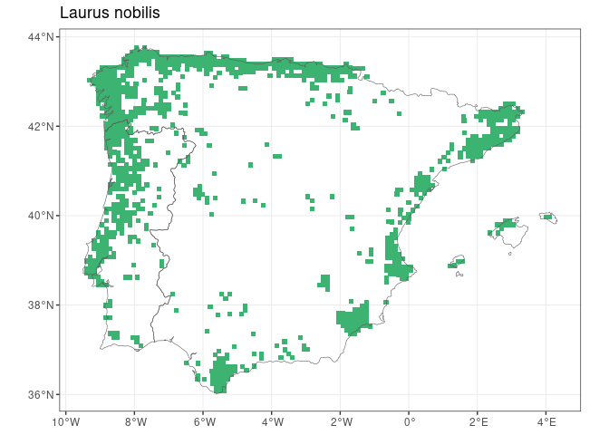
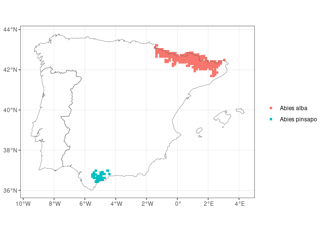
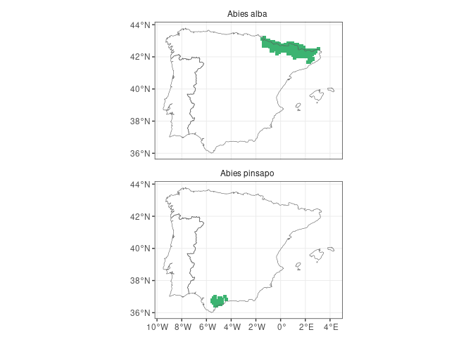
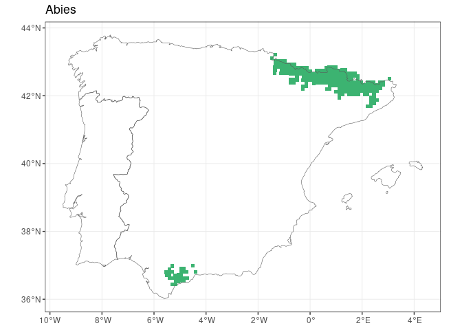
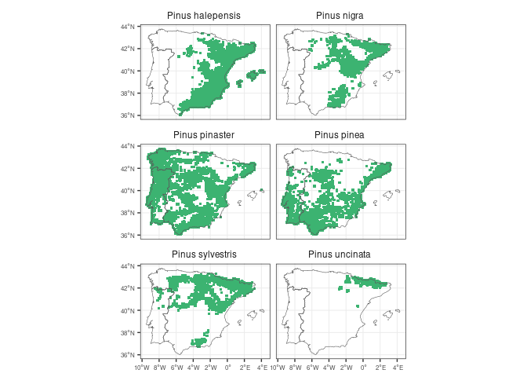

<!-- README.md is generated from README.Rmd. Please edit that file -->

# FloraIberica

<!-- badges: start -->
<!-- badges: end -->

`FloraIberica` R package facilitates checking taxonomic and distribution
data for the c. 6500 vascular plants present in the Iberian Peninsula
and Balearic Islands, based on the [AFLIBER
database](https://doi.org/10.1111/geb.13363).

## Installation

``` r
remotes::install_github("Pakillo/FloraIberica")
```

## Usage

``` r
library(FloraIberica)
```

### Checking if taxa are present

``` r
is_present(genus = "Laurus", species = c("nobilis", "azorica"))
#> Laurus nobilis Laurus azorica 
#>           TRUE          FALSE
```

### Checking if taxa are endemic

``` r
is_endemic(genus = "Aconitum", species = "napellus", 
           subspecies = c("castellanum", "lusitanicum"))
#> Aconitum napellus castellanum Aconitum napellus lusitanicum 
#>                          TRUE                         FALSE
```

### Getting the distribution of plant taxa

Returns sf or dataframe:

``` r
get_distribution("Abies", "pinsapo")
#> Simple feature collection with 30 features and 3 fields
#> Geometry type: POINT
#> Dimension:     XY
#> Bounding box:  xmin: -5.522 ymin: 36.438 xmax: -4.401 ymax: 36.991
#> Geodetic CRS:  WGS 84
#> First 10 features:
#>     Genus Species Subspecies              geometry
#> 213 Abies pinsapo       <NA> POINT (-5.519 36.704)
#> 214 Abies pinsapo       <NA> POINT (-5.522 36.794)
#> 215 Abies pinsapo       <NA> POINT (-5.404 36.616)
#> 216 Abies pinsapo       <NA> POINT (-5.407 36.706)
#> 217 Abies pinsapo       <NA>  POINT (-5.41 36.796)
#> 218 Abies pinsapo       <NA> POINT (-5.413 36.887)
#> 219 Abies pinsapo       <NA> POINT (-5.287 36.438)
#> 220 Abies pinsapo       <NA> POINT (-5.292 36.619)
#> 221 Abies pinsapo       <NA> POINT (-5.298 36.799)
#> 222 Abies pinsapo       <NA> POINT (-5.303 36.979)
```

### Making distribution maps

#### Single taxon

``` r
map_distribution(genus = "Laurus", species = "nobilis")
```



#### Many taxa

Distribution of Iberian *Abies*:

``` r
abies <- get_distribution("Abies")
map_distribution(abies)
```



``` r
map_distribution(abies, facet = TRUE, ncol = 1)
```



``` r
map_distribution(abies, taxo.level = "genus")
```



Iberian Pines:

``` r
pinus <- get_distribution("Pinus")
library(ggplot2)
map_distribution(pinus, facet = TRUE, ncol = 2) + 
  theme(axis.text = element_text(size = 6))
```



## Citation

``` r
print(citation("FloraIberica"), style = "text")
```

Ramos‐Gutiérrez, Ignacio, Lima, Herlander, Pajarón, Santiago,
Romero‐Zarco, Carlos, Sáez, Llorenç, Pataro, Luciano, Molina‐Venegas,
Rafael, Rodríguez, Á. M, Moreno‐Saiz, Carlos J (2021). “Atlas of the
vascular flora of the Iberian Peninsula biodiversity hotspot (AFLIBER).”
*Global Ecology and Biogeography*, *30*, 1951-1957.
<https://doi.org/10.1111/geb.13363>.

Rodríguez-Sánchez F (2023). *FloraIberica: Taxonomic and distribution
data for the vascular plants of the Iberian Peninsula and Balearic
Islands*. <https://pakillo.github.io/FloraIberica>.
