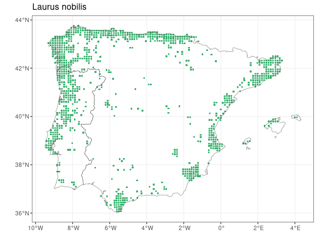
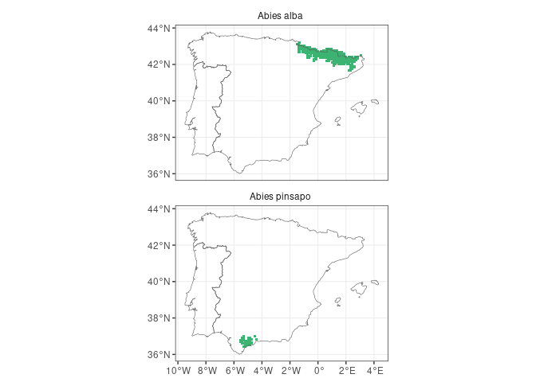
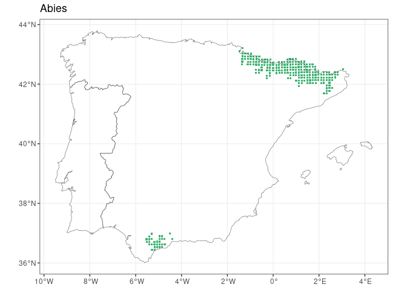
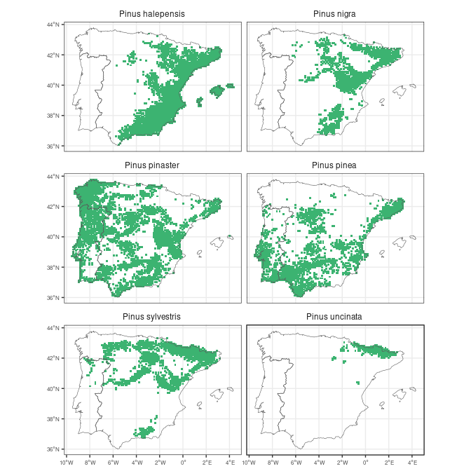
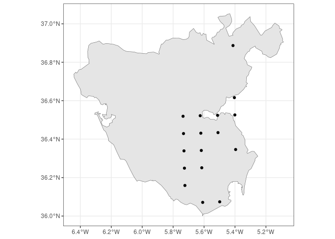

<!-- README.md is generated from README.Rmd. Please edit that file -->

# FloraIberica

<!-- badges: start -->

[](https://github.com/Pakillo/FloraIberica/actions/workflows/R-CMD-check.yaml)
[](https://app.codecov.io/gh/Pakillo/FloraIberica?branch=master)
[](https://lifecycle.r-lib.org/articles/stages.html#stable)
[](https://www.repostatus.org/#active)
<!-- badges: end -->

`FloraIberica` R package facilitates access to taxonomic and
distribution data for the c. 6500 vascular plants present in the Iberian
Peninsula and Balearic Islands, based on the [AFLIBER
database](https://doi.org/10.1111/geb.13363).

## Installation

``` r
remotes::install_github("Pakillo/FloraIberica")
```

## Usage

``` r
library(FloraIberica)
```

### Checking if taxa are present

``` r
is_present(genus = "Laurus", species = c("nobilis", "azorica"))
#> Laurus nobilis Laurus azorica 
#>           TRUE          FALSE
```

### Checking if taxa are endemic

``` r
is_endemic(genus = "Aconitum", species = "napellus", 
           subspecies = c("castellanum", "lusitanicum"))
#> Aconitum napellus castellanum Aconitum napellus lusitanicum 
#>                          TRUE                         FALSE
```

### Getting the distribution of plant taxa

Returns sf or dataframe:

``` r
get_distribution("Abies", "pinsapo")
#> Simple feature collection with 30 features and 3 fields
#> Geometry type: POINT
#> Dimension:     XY
#> Bounding box:  xmin: -5.522 ymin: 36.438 xmax: -4.401 ymax: 36.991
#> Geodetic CRS:  WGS 84
#> First 10 features:
#>     Genus Species Subspecies              geometry
#> 213 Abies pinsapo       <NA> POINT (-5.519 36.704)
#> 214 Abies pinsapo       <NA> POINT (-5.522 36.794)
#> 215 Abies pinsapo       <NA> POINT (-5.404 36.616)
#> 216 Abies pinsapo       <NA> POINT (-5.407 36.706)
#> 217 Abies pinsapo       <NA>  POINT (-5.41 36.796)
#> 218 Abies pinsapo       <NA> POINT (-5.413 36.887)
#> 219 Abies pinsapo       <NA> POINT (-5.287 36.438)
#> 220 Abies pinsapo       <NA> POINT (-5.292 36.619)
#> 221 Abies pinsapo       <NA> POINT (-5.298 36.799)
#> 222 Abies pinsapo       <NA> POINT (-5.303 36.979)
```

### Making distribution maps

#### Single taxon

``` r
map_distribution(genus = "Laurus", species = "nobilis")
```



#### Many taxa

Distribution of Iberian *Abies*:

``` r
abies <- get_distribution("Abies")
map_distribution(abies)
```


``` r
map_distribution(abies, facet = TRUE, ncol = 1)
```



``` r
map_distribution(abies, taxo.level = "genus", size = 0.8)
```



Iberian Pines:

``` r
pinus <- get_distribution("Pinus")
library(ggplot2)
map_distribution(pinus, facet = TRUE, ncol = 2) + 
  theme(axis.text = element_text(size = 6))
```



### Get a checklist of the plants present near a point or polygon

If you want to know the plants near a given site, just pass the
coordinates to
[get_checklist](https://pakillo.github.io/FloraIberica/reference/get_checklist.html):

``` r
site <- c(-5, 40)
head(get_checklist(site))
#>         Genus          Species     Subspecies
#> 1        Acer   monspessulanum monspessulanum
#> 2 Adenocarpus           aureus           <NA>
#> 4 Adenocarpus      complicatus           <NA>
#> 5      Allium scorzonerifolium           <NA>
#> 6       Alnus        glutinosa           <NA>
#> 7     Alyssum      fastigiatum           <NA>
```

The site can be a polygon, so you can easily obtain a list of the plants
present within a given area (e.g. town, province, natural reserve):

``` r
cadiz <- mapSpain::esp_get_prov_siane("Cadiz", epsg = "4326")
head(get_checklist(cadiz))
#>       Genus        Species     Subspecies
#> 1     Abies        pinsapo           <NA>
#> 11     Acer monspessulanum monspessulanum
#> 21     Acer         opalus     granatense
#> 22   Aceras anthropophorum           <NA>
#> 33 Achillea       ageratum           <NA>
#> 57 Achillea        odorata           <NA>
```

You can also obtain an `sf` object rather than a dataframe, so you know
where exactly each plant occurs within or near that polygon (with a
resolution of 10x10 km inherited from the AFLIBER database):

``` r
cadiz.qpyr <- get_checklist(cadiz, sf = TRUE) |> 
  dplyr::filter(Genus == "Quercus", Species == "pyrenaica")

ggplot() +
  geom_sf(data = cadiz) +
  geom_sf(data = cadiz.qpyr) +
  theme_bw()
```



## Citation

``` r
citation("FloraIberica")

If you use FloraIberica, please cite both the data source and the
package as:

  Ramos-Gutiérrez I., Lima H., Pajarón S., Romero-Zarco C., Sáez L.,
  Pataro L., Molina-Venegas R., Rodríguez M. Á. & Moreno-Saiz J. C.
  (2021). Atlas of the vascular flora of the Iberian Peninsula
  biodiversity hotspot (AFLIBER). Global Ecology and Biogeography, 30,
  1951– 1957. https://doi.org/10.1111/geb.13363

  Rodríguez-Sánchez Francisco. 2023. FloraIberica: Taxonomic and
  distribution data for the vascular plants of the Iberian Peninsula
  and Balearic Islands. https://pakillo.github.io/FloraIberica

To see these entries in BibTeX format, use 'print(<citation>,
bibtex=TRUE)', 'toBibtex(.)', or set
'options(citation.bibtex.max=999)'.
```

## Funding

The development of this software has been funded by Fondo Europeo de
Desarrollo Regional (FEDER) and Consejería de Transformación Económica,
Industria, Conocimiento y Universidades of Junta de Andalucía (proyecto
US-1381388 led by Francisco Rodríguez Sánchez, Universidad de Sevilla).


